**Programming Boot Camp**

# Adaloでのアプリ開発と外部連携

**東京工業大学 2023/11/3**
　
　
　
　
　
　　　　　　　　　　　　　　　　　　　　　　　　**Ryo Imahashi**

---
## 目次
  - Adaloとは
  - Adaloに登録しよう
  - テンプレートアプリを操作してみよう
  - Adaloでのアプリ開発の概要説明
  - アプリを作ってみよう
  - 演習
  - まとめ

---
## Adaloとは
- [Adalo](https://www.adalo.com/)は、アメリカ発のノーコードツールです。プログラミング不要でアプリを開発することができます。
- 用意されているパーツから使用したいものを選び、それを画面にドラッグ＆ドロップしていくことで、アプリを作ることが可能です。
- ブラウザで表示するWebアプリだけでなく、AndroidやiOS向けのスマートフォンアプリも開発できます。開発したアプリのGooglePlayやAppStoreでの公開も可能です。
- シンプルで分かりやすいので、ノーコード開発を初めて学ぶためのツールに適しています。

--- 
#### 注意点
- 一つのアプリを複数人で同時編集するのが難しく、Development Phaseでのチーム開発に利用するのはあまりおすすめできません
  - ただし、画面の開発を担当するのが1人だけで、それ以外のメンバーは全員APIの開発を担当するという分担であれば、問題なく使えます


---
#### Adaloで作られたアプリの例
- Union: https://union-jp.site/
  - 大学生が開発した、大学生・大学院生・大学教員・大学職員限定のSNS
  - 2021年に1,000万円の資金調達を実施している
    - https://prtimes.jp/main/html/rd/p/000000001.000076669.html
- その他にも、 #MadeInAdalo でたくさん紹介されています
  - https://www.adalo.com/made-in-adalo
---
## Adaloに登録しよう
- AdaloのSignUp画面にアクセスしてください
  - https://app.adalo.com/signup

- 使用するブラウザは、Google Chromeを推奨します
  - インストール: https://www.google.com/intl/ja_jp/chrome/

---
- 無料で登録できます
- ご自身のEメールアドレス、パスワード、フルネームを入力してください
- 利用規約への同意のチェックを入れてください
- LET'S DO THIS! ボタンを押して、次の画面に進んでください

---

#### 参考: [無料プラン](https://www.adalo.com/pricing)の制限
<!--  -->
- 外部アプリケーションとの連携ができない
  - ただし、14日間はトライアル利用が可能
<!-- - ドメインを変更できない(Adaloのドメインになる)
- ロゴの変更ができない(Adaloのロゴが表示される)
- GooglePlayやAppStoreへの申請ができない -->
- 1アプリで登録できるデータベースのレコード数の上限が200件
- 月間アクション(ボタンクリック時等に行われる処理)回数の上限が1000回

:white_check_mark: 実際にサービスを運用していく際は、有料プランへの移行を検討してください

---
- 利用目的を聞かれるので、 For teaching or taking a class を選択して、Go Build Apps! ボタンを押してください
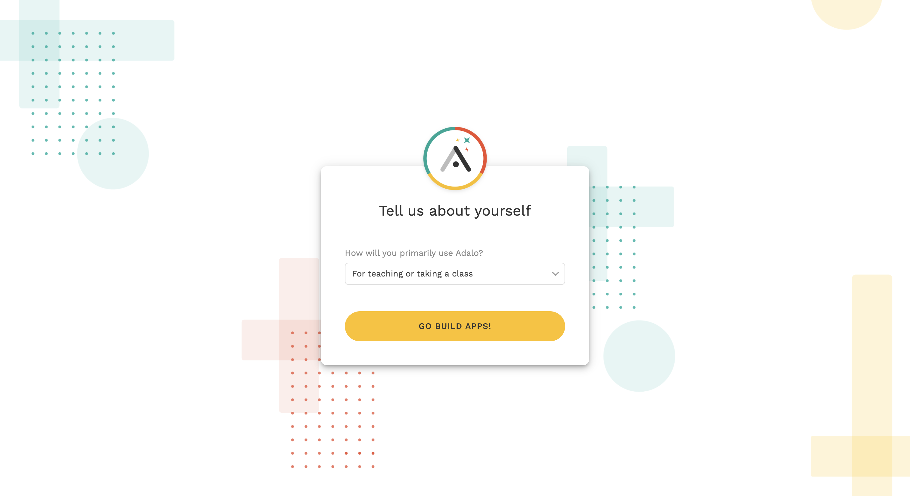

---
#### プラットフォームの選択
- Responsive AppとMobile Onlyが選べます
- PCとMobileの両方に対応できる、Responsive Appを選択しましょう


---
#### テンプレートの選択
- 完成されたアプリがテンプレートとして提供されています
- 今回は、Chatを選択しましょう


<!-- - ADVANCED OPTIONSは変更せず、そのままで大丈夫です -->

---
#### ブランディング

- App Name、Primary Color、Secondary Colorを自由に入力してください
  - Primary Colorは、アプリで最も使われるベースになる色です
  - Secondary Colorは、目立たせたい時に使う色です。重要なボタンなどに使われます。
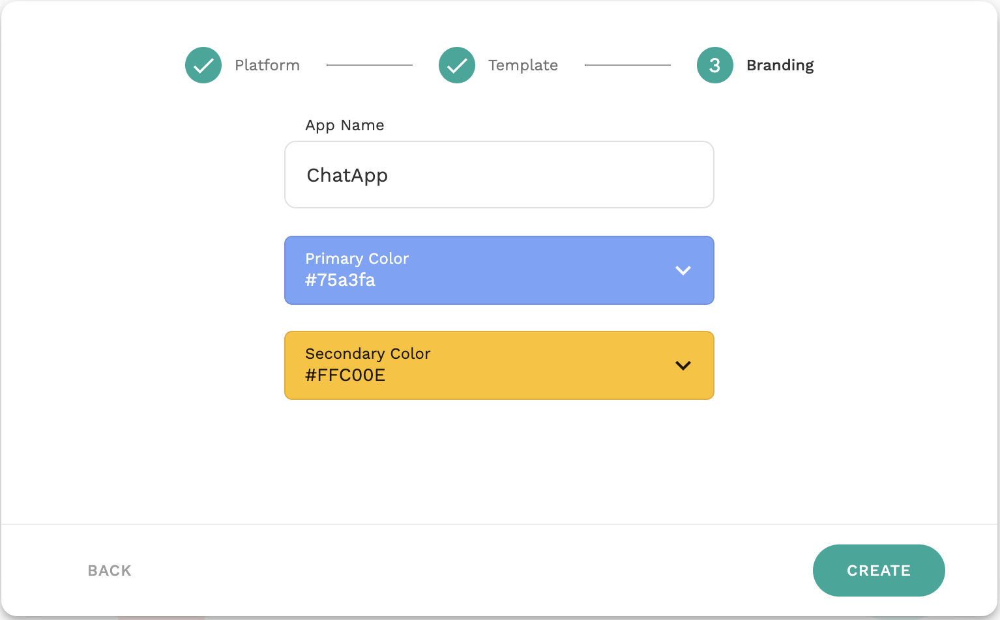

---
- このようなAdaloの管理画面が表示されたらOKです
- 今後はこの管理画面を使って、アプリを開発していきます


---
## テンプレートアプリを操作してみよう
- まずはAdaloで作ったアプリがどのように動作するかを確認するために、先ほど選択したChatアプリを操作してみましょう
- 画面右上のPreviewボタンをクリックしてください


---
- プレビュー画面が起動します
- 一緒にChatアプリを操作してみましょう


---
- Signupしましょう
  - EmailとPasswordはメモしておいてください(後で使います)
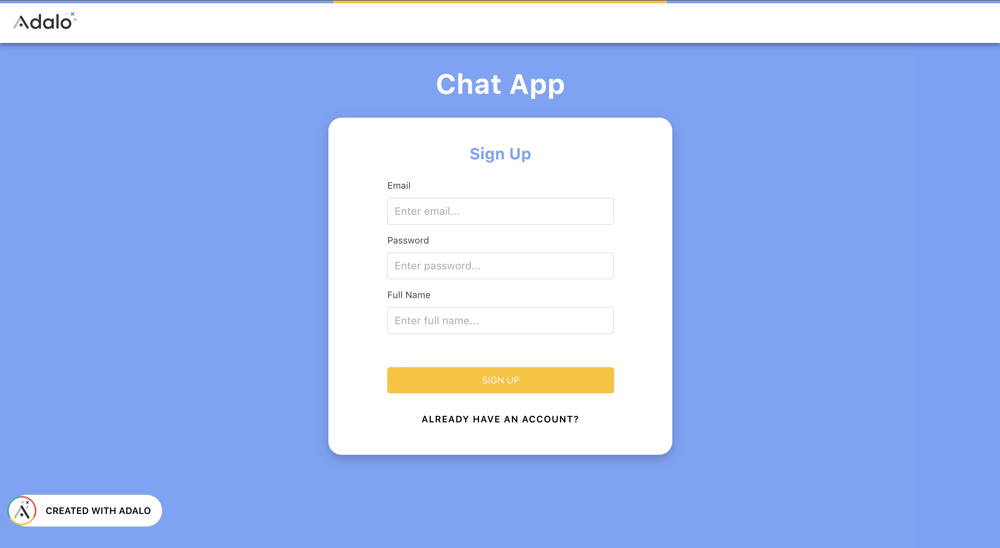


---
- まだ会話が行われていないため、リストが空の状態です
- 画面右上の NEW CHAT ボタンを押してみましょう


---
- サンプルユーザーのリストが表示されます
- Will Wを選んでクリックしてください


---
- メッセージを送信できます
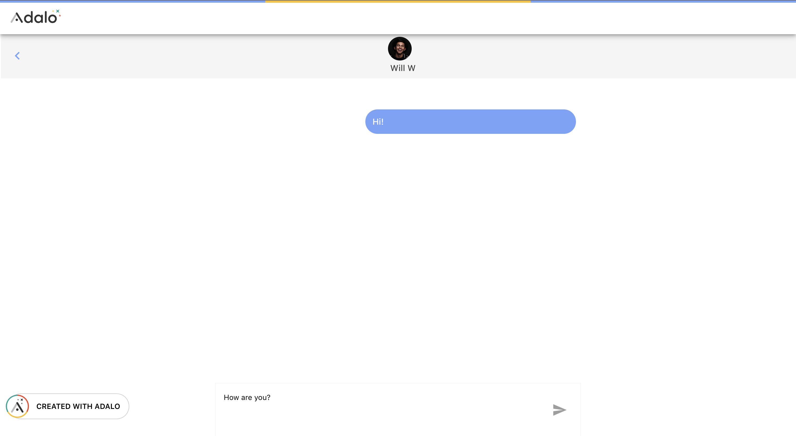

---
他にも以下のような機能がありますので、試してみましょう。
- プロフィール写真の更新
- パスワードの変更
- ログアウト
- ログイン
  - 以下のように入力すると、サンプルユーザーの Will W としてログインができます
    - Email: will@email.com
    - Password: 123

---
- 今回試したChat以外にも、いくつかのテンプレートが提供されています。
- 自分たちが作りたいアプリに近いものがあれば、そのテンプレートを流用して開発スピードをアップさせられるかもしれません。時間がある時に、他のテンプレートも試してみましょう。

---
## Adaloでのアプリ開発の概要説明
次に、Adaloでのアプリ開発の概要を説明していきます。

---
### 3つの基本コンセプト
- 基本となる以下3つのコンセプトについて紹介します
  - Components
  - Database
  - Actions

--- 
#### Components
- ユーザーインターフェースを作るために画面上に配置される要素。
- 例:
  - リスト
  - ボタン
  - テキスト
  - 画像


---
#### Database
- 整理されたデータの集合。
- データの登録、読込(表示)、更新、削除が行われる。
- 例: Chatアプリの場合

<!--  -->


---
#### Actions
- 特定のコンポーネントをクリックした時に何を行うかを指定するために使われる。
<!-- - コンポーネントとそこで表示するデータベース内のデータを紐付けたり、ユーザー体験をカスタマイズする。 -->
- 例:
  - 別の画面に遷移させる
  - データベースのデータを登録、更新、削除する


---
### Adaloの機能説明
次に、Adaloの管理画面で利用できる機能を紹介していきます


---
#### Canvas
- 画面を作る作業領域
- 要素を選択したり、ドラッグアンドドロップで動かしたりできる

<!-- - スクロール、拡大、縮小ができる -->
<!--  -->

---

#### Left Toolbar
左側のツールバーの各機能を紹介します。


---
######  Add Panel
- コンポーネントや画面を選択してアプリに追加できる
- 機能のテンプレートを追加することも可能
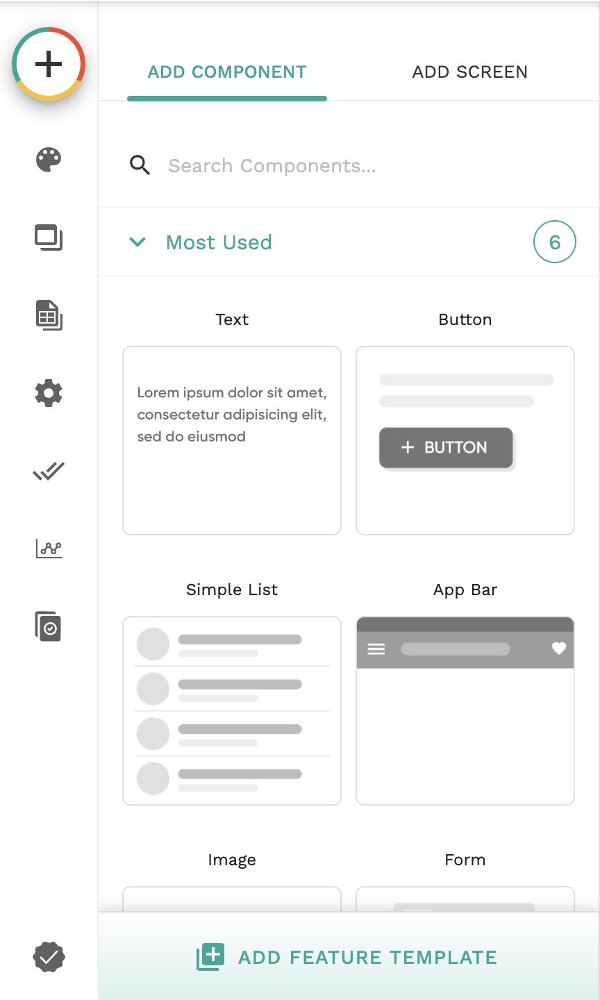
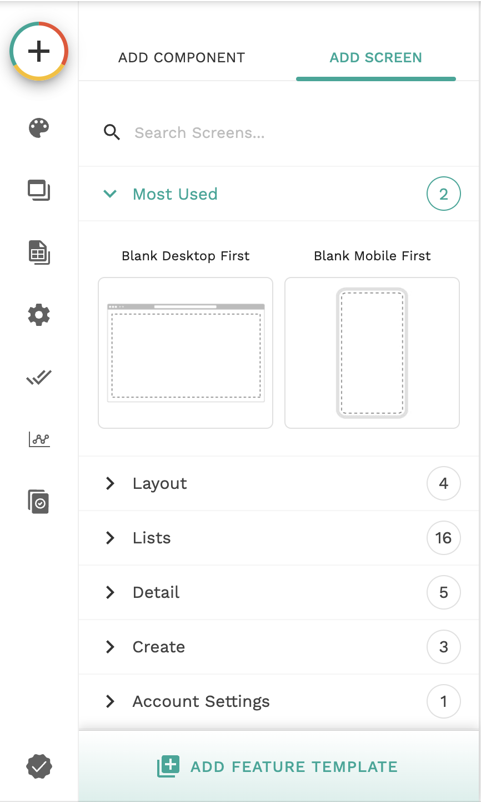
<!-- 画面とコンポーネントの追加を実演する -->
---
######  Branding
- 色やフォントを変えられる
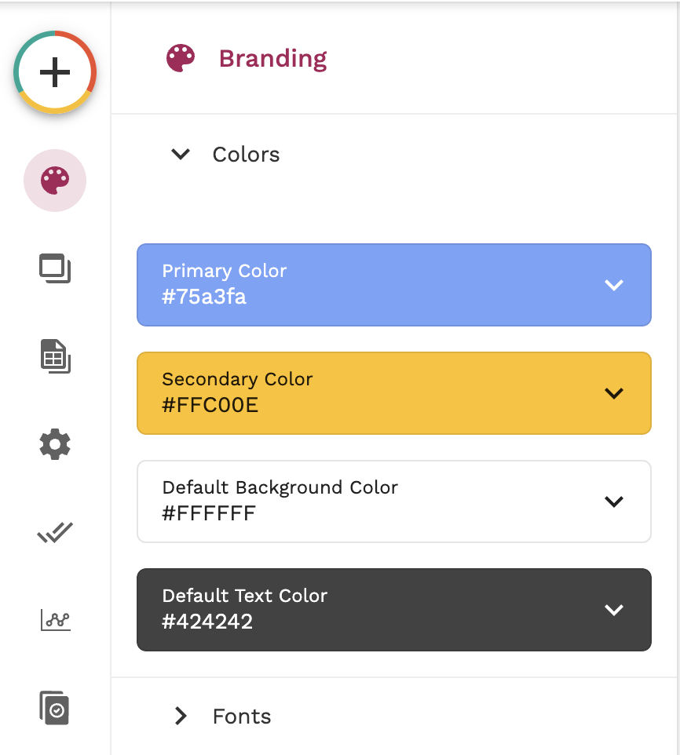

<!-- 色とフォントの変更を実演する -->

---
######  Screens
- 画面の一覧や、その画面の構成を表示できる


---
######  Database
- データベースの構成や保存されているデータを表示できる
- Collection: 同じ属性(プロパティ)を持ったデータの集まり
 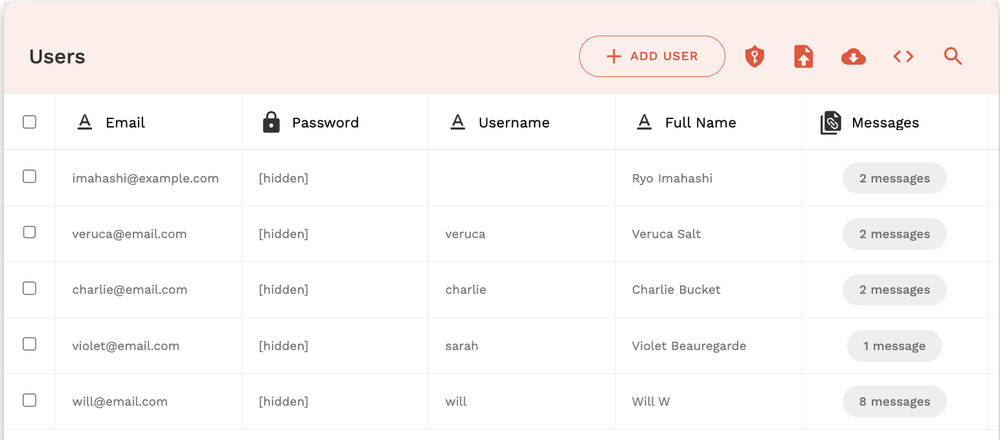

---
######  Settings 
- アプリの名前やアイコンを設定できる
- キャンバスに関する表示設定ができる
- アプリへのアクセス権限の設定ができる
- アプリの複製や削除ができる
- 位置情報機能を使うためのAPIキーの設定ができる


---
###### Publish
- 作ったアプリを公開できる(有料プランのみ)


---
######  Analytics
- 利用状況を分析したレポートを見ることができる
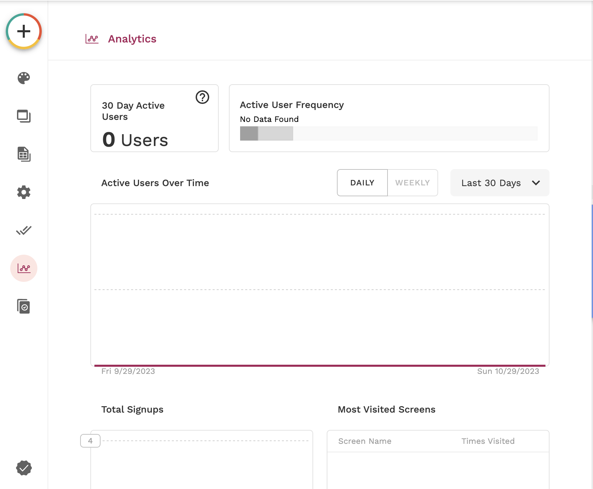

---
######  Version History
- バージョン履歴を作成したり、アプリをバージョン履歴作成時と同じ状態に戻すことができる(有料プランのみ)
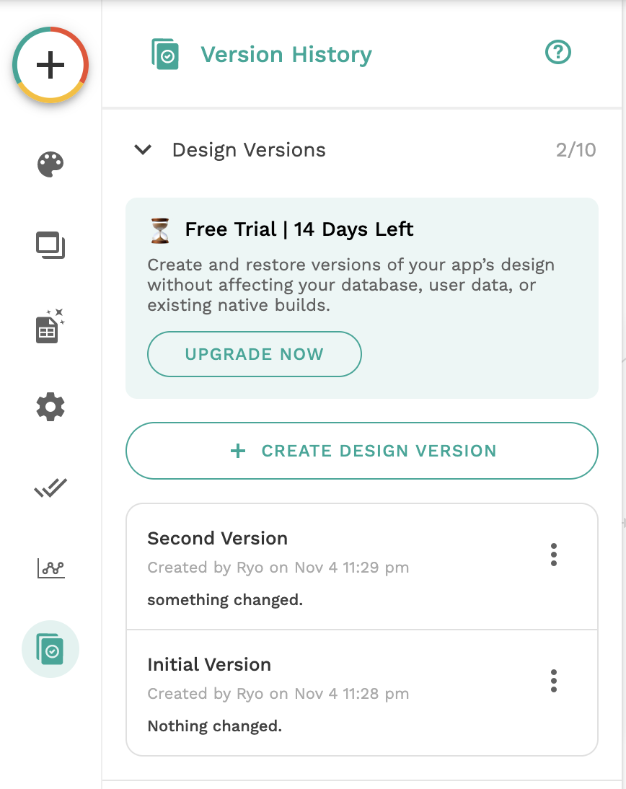

---
#### Top Bar
上部のツールバーの各機能を紹介します。


---
###### App Switcher
- 開いているアプリの名前が表示される
- アプリを切り替えられる
- 新しいアプリを追加できる


---
######  Preview, Share
- アプリを実行して試すことができる


---
###### Account Menu
- 各種設定ができる
- ヘルプやドキュメントを開ける
- Adaloのエキスパートを探せる
- ログアウトできる


---
#### 開発に役立つTipsを覚えておこう
- 間違って編集してしまった時は、Windowsなら`Ctrl + Z`、Macなら `Command + Z ` で元に戻せます
- Adaloの開発ツールでは、日本語の直接入力がうまくいかないことがあります。日本語のテキスト入力はコピー＆ペーストで行ってください。


<!-- ---
## チュートリアル
Learn Adaloのコンテンツをやってみる？ -->

---
## アプリを作ってみよう
次に、新しくアプリを作ってみましょう。


---
#### 作りたいアプリのUI
ペットの健康管理アプリを作ってみましょう。
まずはUIを確認していきます。


---
###### 会員登録画面
- 以下の項目を入力して会員登録できる
  - Email
  - Password
  - Full Name
- 会員登録済の人向けに、ログイン画面へのリンクがある


---
###### ログイン画面
- 以下の項目を入力してログインできる
  - Email
  - Password
- パスワードを忘れた人向けのリンクがある
- 会員登録画面へのリンクがある


---
###### ペット登録画面
- 名前を入力できる
- 写真を選択できる
- 誕生日を入力できる
- 登録ボタンで確定し、ペット一覧画面に遷移できる


---
###### ペット一覧画面
- 登録したペットが一覧で表示できる
- ペットをクリックすると、そのペットのペット詳細画面に遷移できる
- 右下のアイコンを押すと、ペット登録画面に遷移できる


---
###### ペット詳細画面
- 体重記録画面へのリンクがある
(Link2は演習用)
- 誕生日が表示される
- 最新の体重が表示される


---
###### 体重記録画面
- 体重の遷移を示すグラフが表示される
- 現在の体重を入力できる
- ボタンを押して体重を追加できる


<!-- ---
###### 活動記録画面
- 
 -->


---
#### アプリ作成
それでは、実際にアプリを作っていきます。

- CREATE NEW APPを選択してください


---
- Responsive Appを選択してください


---
- テンプレート: Blank Mobile First を選択してください
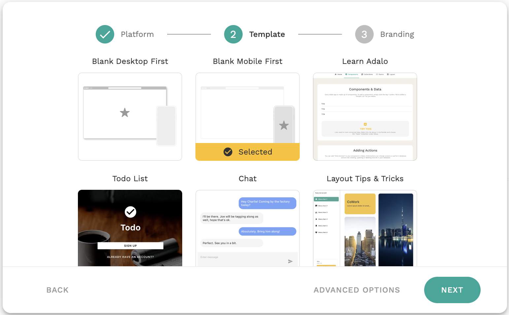

<!-- モバイルを提供するのであれば、まずモバイルから始めることをお勧めします。画面を小さくするよりも、画面を大きくしてコンポーネントを並べ替える方が簡単です。このシナリオでは、コンポーネントがモバイルの画面からはみ出す傾向があります。 -->
<!-- We definitely recommend starting with mobile first if you plan to offer it. It's easier to make screens bigger and rearrange components, than it is to make them smaller - components tend to hang off the mobile screen in that scenario. -->


---
- App Name、Users of this app、Colorを自由に決めてください


---
- アプリができました
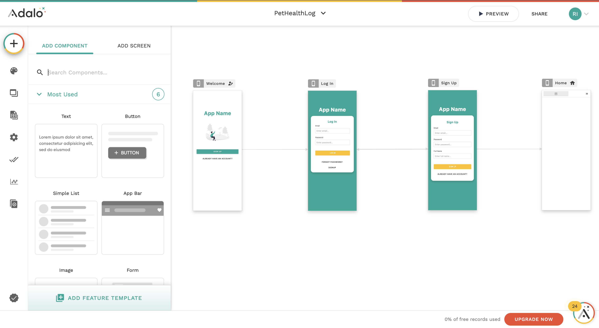

---
## データベースを学ぼう
アプリ開発の最初にそのアプリで扱うデータを定義しておくことで、その後の開発をスムーズに進めることができます。

まずは、データベースがどのようなものかを確認します。

---
#### Database(復習)
- 整理されたデータの集合。
- データの登録、読込(表示)、更新、削除が行われる。
- 例: Chatアプリの場合

<!--  -->


---
- データベースはよく「表計算ソフトのようなもの」と例えられます。
- データベースを使ってデータを作成(CREATE)、読み取り(READ)、更新(UPDATE)、削除(DELETE)することができます。 これらの操作を総称してCRUDと呼びます。


---
#### Adaloのデータベースの基本
 このアイコンからAdaloのデータベースにアクセスできます。
Adaloのデータベースの構成要素は、以下の3つです。
- Collection
- Property
- Record

---
###### Collectionとは
同じ属性(Property)を持ったデータの集まり
 

---
- Collectionは、データベースで扱う様々なデータをデータの種類ごとに分割し、整理するためのものです。(類似の言葉として、テーブルがあります)
- ユーザーが1度の操作で登録や更新、削除といった操作をするデータのまとまりがCollectionになることが多いです。<!-- (名詞として表現できるものがCollectionになることが多いと言われます) -->
- デフォルトでは、UsersがCollectionとして用意されており、それ以外は開発するアプリに合わせて追加していきます。

※ どのようなCollectionを追加するかを決めるのはとても難しいです。練習しながら慣れていきましょう。(悩んだ時は、メンター陣に相談するのもおすすめです)

---
###### Recordとは
- Recordは、Collection内へ情報を保存する際の単位です。
  - 画像の1行が1つのRecordとなります。
- Users Collectionの例では、1人のユーザーが持つ情報をまとめて1Recordとして登録します。


---
- Recordは基本的にアプリの画面上のフォームから登録できるようにしますが、Recordの表示中に右上の「+Add xxxx」ボタンを押して、右の画像のようなフォームから登録することも可能です。
- Collection内のRecordの検索や、CSVファイルのアップロード(インポート)・ダウンロードも可能です。


---
###### Propertyとは
- Propertyは、Recordを構成する一つ一つの項目です。
- Users Collectionは、Eメール、パスワード、ユーザー名、氏名といったPropertyで構成されます。
- Propertyの値は空で登録される場合もあります。


---
Propertyがどのようなデータかを定義するため、Property追加時はTypeを選択します。
- Text
- Number
- True/False
- Date/Time
- Date
- Image
- File
- Location


---
Relationshipとは
- 1つのRecordに対して多数のPropertyを保存する代わりに、Relationshipと呼ばれる複数のCollectionを関連づけるための特別なPropertyを設定します。これにより、Collectionを扱いやすい形に分割することができます。

---
- 例えば、Chatアプリでユーザーが送信したメッセージはUsers Collectionとは別のMessages Collectionに保存され、これら2つのCollectionはRelationshipで関連づけられます。
  - Users側にはMessagesというRelationshipが、Messages側にはSenderという(Usersとの)Relationshipが登録されています。

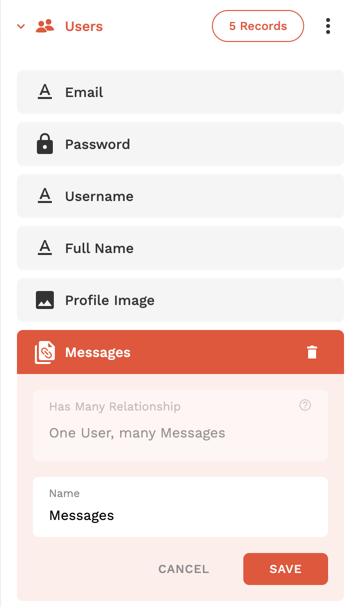


---
Relationshipの種類
- AdaloのRelationshipでは、Collection間で紐付けられるRecordの数に応じて、1対多と多対多という2つの種類のいずれかを選択します。 

---
1対多のRelationship
- 1つのRecordが、別のコレクションにある複数のRecordと関係を持つことを意味します。 
- Relationshipを設定しようとしているCollectionを1と多のどちらにするかで、2種類の選択肢が現れます。


---
1対多のRelationshipの例
- Chatアプリでは1人のユーザーが複数のメッセージを送信しますが、メッセージの送信者は1人のユーザーなので、Users CollectionとMessages CollectionのRelationshipは1対多になります。

 

<!-- 例えば、主催者がイベントに対して1人だけいる場合の、主催者とイベントのRelationshipは1対多です。 -->
<!-- 例えば、1人のユーザーが複数のイベントを主催したり、複数のイベントに1人の主催者がいたりしますが、どちらも真の1対多の関係を表しています。 -->

---
多対多のRelationship
- 両方のCollectionの1Recordが、もう一方のCollectionの複数のRecordに紐付けられることを意味します。


<!--  -->

---
多対多のRelationshipの例
- Chatアプリでは1人のユーザーが複数の会話(誰とどんなメッセージをやりとりしたかを管理するもの)を持ち、1つの会話には複数のメンバー(ユーザー)が所属するので、Users CollectionとConversations CollectionのRelationshipは多対多になります。

 

<!-- - 例えば、参加者は複数のイベントに参加できるし、イベントには複数の参加者がいるという場合の、参加者とイベントのRelationshipは多対多です。 -->
<!-- 例えば、イベントが複数のホストを持ち、ホストが複数のイベントを持つことが可能です。 -->
<!-- ---
「イベントには主催者が1人だけいる」「参加者は複数のイベントに参加できるし、イベントには複数の参加者がいる」と定義するリレーションを作りたいとします。そこで、選択肢を「User」という言葉で読むのではなく、「User」を「Host」という言葉に置き換えることで、どの選択肢を選べばよいのかをより明確にすることができます。この場合は、選択肢1となります。 もし、「参加者」と「イベント」の関係を作るとしたら、あなたはどちらを選びますか？ 実際に試してみてください。
>コレクションのレコードをクリックすると、そのコレクション内のレコードも表示されるので、リレーションシップを含むプロパティは、Adaloのデータベースの列としても視覚化できます。 -->

---
## データベース設計

<!-- ---
TODO: 演習の前に一度テンプレートのアプリを例にデータベース設計の手順を紹介して、一度流れを理解してもらう? -->

次に、実際にデータベースを設計しましょう。

---
#### データベースを設計してみよう
サンプルアプリのUIを見ながら、データベースを設計してみましょう。手順は次のページで紹介します。


---
###### データベース設計の手順
1. UIを見ながら、保存が必要になるデータをリストアップしましょう。テキストエディタ(メモ帳アプリ等)に書き起こしてください。
2. リストアップしたデータがどのようなCollectionに分類できるかを考えて、Adaloのデータベースに必要なCollectionを作成しましょう。
3. 1でリストアップしたデータを適切なCollectionにPropertyとして追加してください。その際、適切なTypeを選択してください。
4. 他のCollectionと関連を持つCollectionには、Relationship Propertyを設定しましょう。

--- 
※ 次のスライド以降に解説がありますが、答えを見る前に一度自分で手を動かして考えてみることをおすすめします。

※ 絶対的な正解はないです。悩んだら、直感に従って進めてみてください。

---
###### 解説
UIを見ながら、保存が必要になるデータをリストアップすると、以下のようになりました。
```
- ユーザーのEmail
- ユーザーのパスワード
- ユーザーのFullName
- ペットの名前
- ペットの写真
- ペットの誕生日
- ペットの体重
- ペットの体重の登録日時
```

- その他のデータを挙げられた人がいれば、教えてください！

<!--  -->

---
リストアップしたデータがどのようなCollectionに分類できるかを考えて、今回はこの3つに分類することにします。
```
- Users
- Pets
- PetWeightLogs
```

- ユーザーのCollectionとペットのCollectionの2つを用意した人は多いのではないでしょうか？
- ペットの体重記録のCollectionは用意しなかった人もいるかもしれません。(ペットの体重とその登録日時をペットのCollectionに含める方法も間違いではないです。後ほど解説します。)
- その他のCollectionの分類をした人はいますか？
<!-- 極論、1Collectionでもやれなくはないよ -->

---
Collectionの分類に関する補足
- 「Aが決まればBが1つに決まる」という関係が成り立つ時、AをCollectionに、BをそのCollectionのPropertyにする場合が多いです。
  - ユーザーが決まれば、ユーザーのEmail、パスワード、FullNameがそれぞれ1つに決まります。
  - ペットが決まれば、ペットの名前、写真、誕生日がそれぞれ1つに決まります。
- 「Aに対してBが複数存在する」という関係が成り立つ時、AとBは別々のCollectionに分割することが多いです。
  - (1匹の)ペットに対して、ペットの体重とその登録日時は複数存在します。

<!-- ※ TODO: 従属性についてわかりやすい言葉で解説 -->
<!-- コツは、関連性の強い複数のデータを一つに決めることができるものを、Collection名にする -->
<!-- ※ Email,パスワード、FullNameは、ユーザーが決まれば一つに決まるので、UsersというCollectionにまとめる。
※ ペットの名前、写真、誕生日は、ペットが決まれば一つに決まるので、PetsというCollectionにまとめる。 -->

<!-- ※ ペットの体重とその登録日時は同時に登録されるため、セットで扱う -->
<!-- ※ ペットの体重とその登録日時は、1匹のペットに対して複数登録されるので、Collectionを分ける(ペットとペットの体重が1対多の関係になる) -->

---
- CollectionをAdaloのデータベースに登録しておきます。
  - ADD TO DATABASE > Add Collectionから手動で追加してください
  - Magic Add は追加したい機能をテキスト入力するとAIがデータベースの変更を提案してくれますが、今回は使いません
  <!-- 追加したい機能をテキストで入力するとAIがデータベースの変更を提案してくれますが、毎回結果が異なるので、 -->
- Usersはデフォルトで作成されています。


---
次に、1でリストアップしたデータを適切なCollectionの配下にPropertyとして追記すると、以下のようになりました。()の中は選択するTypeです。
```
- Users
  - Email(Text)
  - Password(※Password)
  - FullName(Text)
- Pets
  - Name(Text)
  - Image(Image)
  - Birthday(Date)
- PetWeightLogs
  - WeightKg(Number)
  - RegisteredTime(Date&Time)
```
※ Passwordはデフォルトで設定される特殊なTypeです。
<!-- Textを暗号化したものになります。 -->

---
- Adaloで実際にPropertyを追加します。
- Users Collectionはデフォルトで設定済みで、必要な項目は含まれています。
- Usernameは不要ですが、削除できないのでそのままにしておきます。
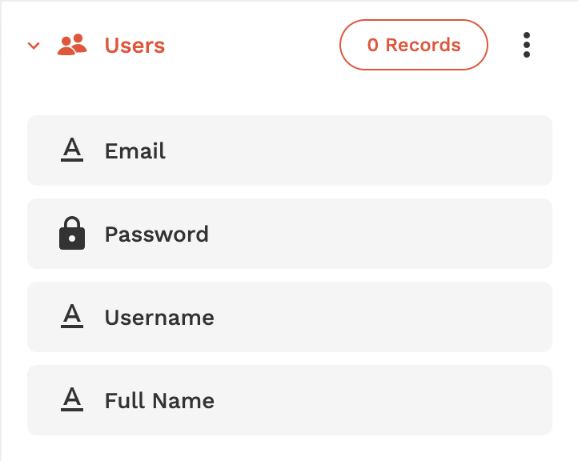

---
- Pets CollectionのPropertyはこのようになります。


---
- PetWeightLogs CollectionのPropertyはこのようになります。
- Collection追加時にデフォルトで設定されるName Propertyは不要なので、削除します。
  - ドラッグアンドドロップで順番がCollection内の一番上でなくなるように移動すれば、削除できます。

<!--  -->


---
最後に、他のCollectionと関連を持つCollectionには、Relationship Propertyを設定します。

- Users Collectionを選択して、Pet Collectionとの1対多のRelationshipを追加します。


---
- Pets Collectionを確認すると、Users Collection側でRelationshipの設定をしたので、自動でUsers CollectionとのRelationshipが追加されています。
  - Users Collection側が1なので、末尾のsが省略されて、Userという Property名になっています。


---
- Pets Collectionに、PetWeightLogs CollectionとのRelationshipを追加します。
  - Pets Collectionを選択して、PetWeightLogs Collectionとの1対多のRelationshipを追加します。


---
PetWeightLogs Collectionを確認すると、Pets Collection側でRelationshipの設定をしたので、自動でPets CollectionとのRelationshipが追加されています。
  - Pets Collection側が1なので、末尾のsが省略されて、Petという Property名になっています。


---
参考: Pets Collectionにペットの体重とその登録日時を含めた場合どうなるか

以下のようにレコードが登録されますが、この場合、少し困ることが出てきます。


---
困ること
- 1匹のペットに対して異なるペットの体重とその登録日時が結合されたRecordが複数登録されるため、ペットの情報(Name,Image,Birthday)が重複して登録されてしまう。
  - 1匹のペットの情報を変更するために、重複して登録されたRecordを全て更新しないといけなくなり、処理が複雑になる。
- Adaloには一つのCollectionを選んでそこにRecordを登録するためのフォームを自動生成する便利な機能があるが、データを登録する単位でCollectionが分かれていないので、それが使えなくなる。

---
データベース設計は以上です。

※ この後の作業で混乱しないために、Adaloのデータベースを資料と同じ状態に設定しておくことをおすすめします。

---
## アプリを開発しよう
設計したデータベースを使って、サンプルアプリを開発していきましょう。

---
###### 会員登録画面、ログイン画面

:white_check_mark: 会員登録画面、ログイン画面はデフォルトで生成されるようになっています。
- 画面右上のPREVIEWボタンをクリックして、プレビュー機能で動作を確認してみましょう。


<!-- TODO: welcome画面を消す？ -->

---
Mobile Firstでアプリを作っていくため、ここからはブラウザの開発者ツールを使い、Mobileサイズでプレビューをします。
- Chromeの場合、以下の手順で開発者ツールを開きます
  - 右上の三点リーダ > More Tools > Developer Tools 
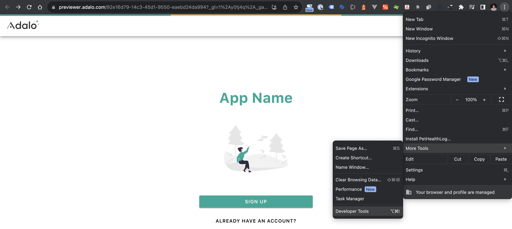

---
Chromeの開発者ツールでは、様々なデバイスの画面サイズで表示を確認することができます。
- iPhone 12 Proを選択してプレビューをします


---

- 会員登録画面
  - 会員登録をすると、Home画面に遷移します
  - ブラウザの戻るボタン(←)で戻り、 ALREADY HAVE AN ACCOUNT? をクリックしてログイン画面に遷移しましょう


---
- ログイン画面
  - 先程会員登録したのと同じEmail、Passwordでログインすると、Home画面に遷移します
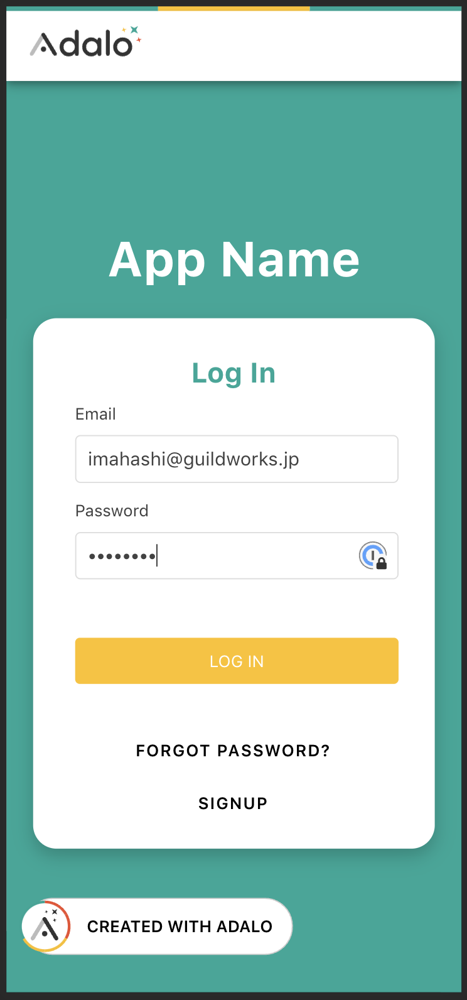


---
会員登録画面、ログイン画面はそのままで問題ないことがわかりました。
その他の4画面を作成していきましょう。

---
###### ペット登録画面
- 名前を入力できる
- 写真を選択できる
- 誕生日を入力できる
- 登録ボタンで確定し、ペット一覧画面に遷移できる

こちらの画面を作りましょう


---
- ADD SCREENからBlank Mobile Firstを選択します
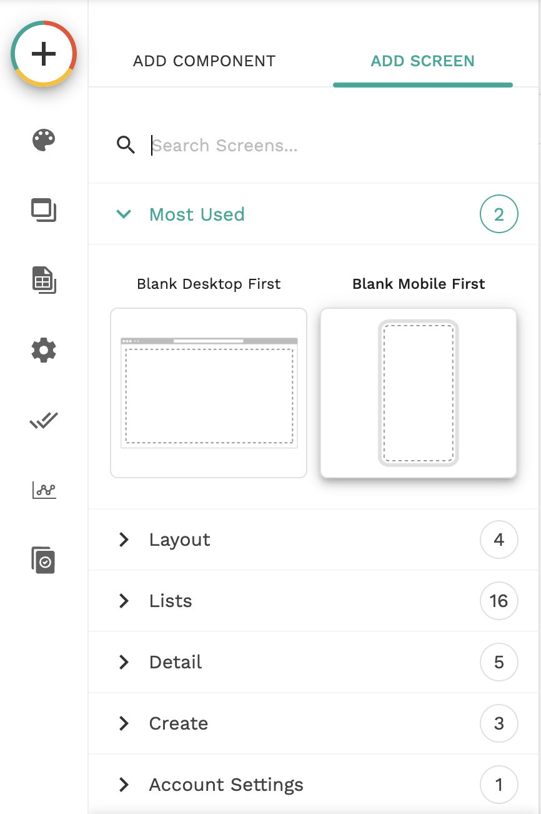

---
- Screen Nameを入力します


---
Screenが追加されました。

この上に必要なコンポーネントを追加していきます。


---
- ADD COMPONENTからApp Barを選択します


---
- 画面上に配置します
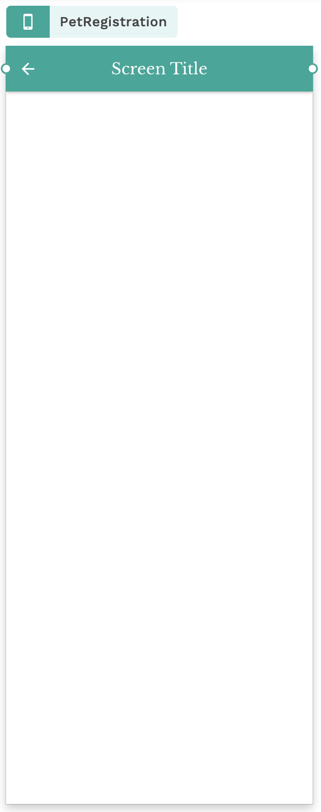

---
- Title > Textの値を画面名(PetRegistration)に変えます
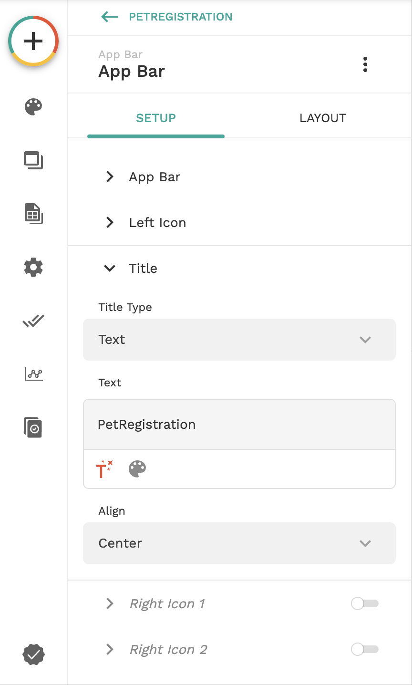

---
- ADD COMPONENTからFormを選択します
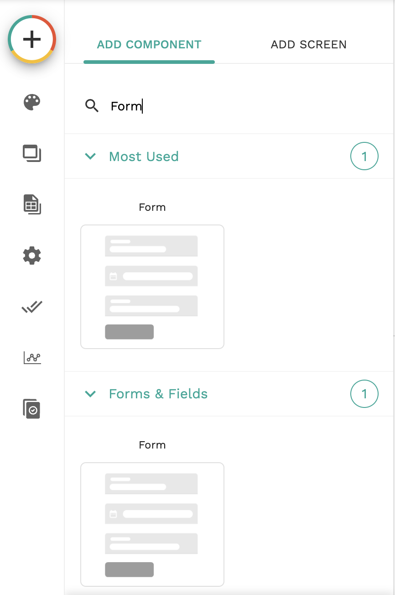

---
- 画面上に配置します


---
- Which data collection?でPetsを選択します
  - 選択したCollectionに合わせたフォームが自動生成されます
- What do you want the form to do?でCreate New petを選択します


---
- FieldsのBirthdayとImageの順番をドラッグ&ドロップで入れ替えます
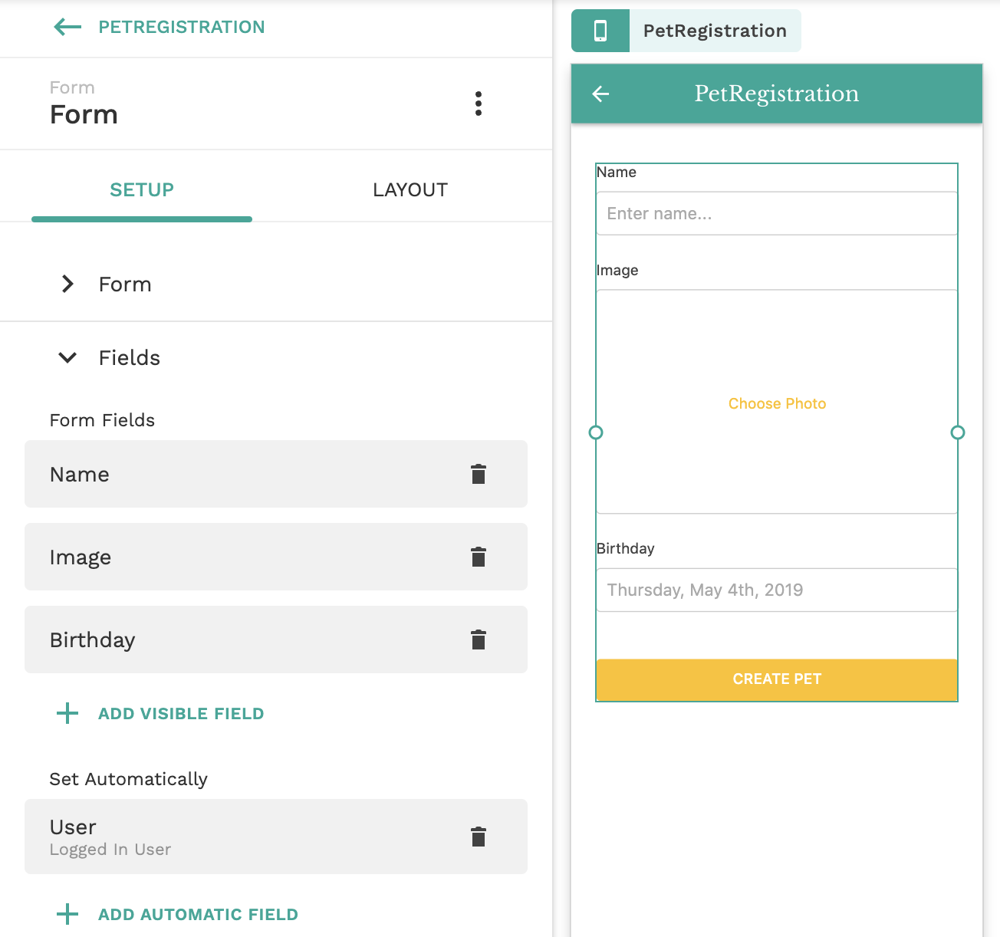

---
- Submit ButtonのClickActionsにCreate Petが設定されていることを確認します


---
まだ導線がなく、表示することができないので、表示できるようにしましょう
- ログイン状態の時に最初に表示されるHome Screenに設定します
  - Screensからペット登録画面を選び、Screen Navigation TypeをHome Screenに変更します

---
- ログイン画面の Form > Submit buttonを開き、ClickActionsに設定されているLinkのScreenをペット登録画面に変更します


---
ペット登録画面の動作を確認してみましょう。
- プレビュー機能でログインをすると、ペット登録画面が表示できます。
- 名前の入力、画像の選択、誕生日の選択ができます。
- CREATE PETボタンを押して、ペットを登録できます
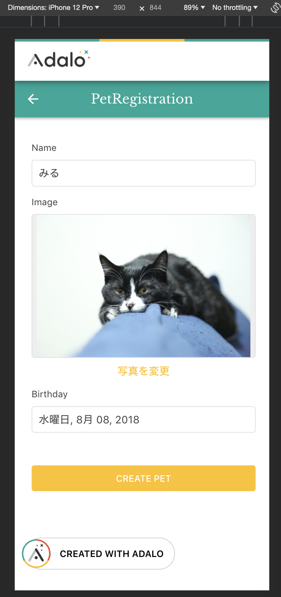

---
ペットの登録後、データベースのPets CollectionにRecordが登録されたらOKです。
 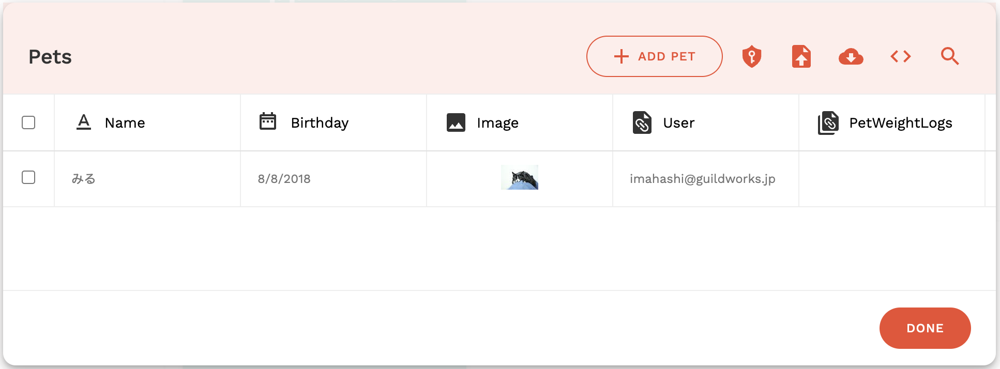

これで、ペット登録画面は完成です。

---
###### ペット一覧画面
- 登録したペットが一覧で表示できる
- ペットをクリックすると、そのペットのペット詳細画面に遷移できる
- 右下のアイコンを押すと、ペット登録画面に遷移できる


次は、こちらの画面を作りましょう

---
- ADD SCREENからApp Barを選択して、Screen Nameを入力してください


---
- ADD COMPONENTからImageを選択してください


---
- 画面上に配置してください
- Image Source -> Uploadから、ペットの写真をアップロードしてください


---
- ADD COMPONENTからTextを選択してください


---
- Textにペットの名前を入力し、文字色をWhiteに変更しましょう
- 選んだ写真によっては白い文字が見えづらくなりますので、次は文字を見やすくします


---
- ADD COMPONENTからRectagleを選択してください


---
- ペットの名前の上に重ねて配置してください
- Backgroundの色でBlackを選択した後、RGBAのAの値を10に変更してください
  - RGBAは色を表す形式のひとつで、色をRed、Green、Blueの三原色のそれぞれの強度と、透明度(Alpha)の組み合わせで表現します


---
- Screensからペット一覧画面を選択し、Componentsの並び順でRectangleがTextよりも上になっていることを確認してください
  - 上にあるものが手前に表示されるため、今はRectangleがTextを隠してしまっています
<!--  -->


---
- 順番を入れ替えて、Textを一番上に、Rectangleを2番目にしましょう
  -  Textが手前に表示され、Rectangleのおかげで白い文字が見やすくなりました


---
次に、ペットをもう一匹表示しましょう
- 追加した3つのコンポーネント(Image, Rectangle, Text)をCanvas上で選択し、MAKE GROUPをクリックします


---
- 作成したGroupを選択した状態でコピー&ペースト(Windowsなら`Ctrl + C`と`Ctrl + V`、Macなら`Command + C`と`Command + V`)をして、複製されたGroupを下に配置します


---
- 2つ目のImage、Textを別のペットのものに変更しましょう


---
次に、ペット登録画面への導線を追加します
- ADD COMPONENTからAction Buttonを選択してください


---
- 画面右下に配置してください
- Icon and Text ColorをDefault Background(White)に変更してください


---
- ADD ACTION -> Link -> [ペット登録画面名] を選択してください


---
ペット登録画面からペット一覧画面への導線も追加しておきましょう
- ペット登録画面のRegisterボタンを選択してください
- ADD ACTION -> Link -> [ペット一覧画面名] を選択してください
※ 導線を追加しただけなので、まだペットの登録はできません(データの登録は次回のレクチャーでやります)


---
- SignUp画面のSIGNUPボタンとLogin画面のLOGINボタンの遷移先も、Homeからペット一覧画面に変更しておきましょう
<!--  -->


---
- デフォルトで作成されていたHome画面は不要になったので、削除しましょう

---
ペット一覧画面の見た目を確認してみましょう。
- ペット登録画面のプレビューをした時と同様に、ペット一覧画面のScreen Navigation TypeをHome Screenに変更してください
- プレビュー機能でログインをすると、ペット一覧画面が表示できます。

これで、ペット一覧画面のUIは完成です。


---
###### ペット詳細画面
- 体重記録画面へのリンクがある
(Link2は演習用)
- 誕生日が表示される
- 最新の体重が表示される

次は、こちらの画面を作りましょう


---
- ADD SCREENからInfo with Linksを選択して、Screen Nameを入力してください


---
- Image Sourceでペット一覧画面で使用した写真をUploadしてください


---
- TextをBirthdayというラベルとその値、Latest Weightというラベルとその値に書き換えましょう


---
- Link 1というTextをWeihgt Logに変更しましょう
- Link 2はそのまま残しておきます
(最後の演習時間で作成した画面への導線として使ってください)


---
ペット一覧画面からペット詳細画面に遷移できるようにしましょう
- ペット一覧画面の1匹目のペットに関するコンポーネントをまとめたGroupを選択し、ADD ACTION -> Link -> PetDetail とクリックしてください
  <!-- - この設定を2匹目のペットに関するコンポーネントをまとめたGroupにも設定しても良いです。ただし、ペット詳細画面はどちらのペットをクリックして遷移しても、同じ表示になります。 -->


---
- プレビュー画面で表示を確認しておきましょう

ペット詳細画面のUIはこれでOKです。


---
###### 体重記録画面
- 体重の遷移を示すグラフが表示される
- 現在の体重を入力できる
- ボタンを押して体重を追加できる

最後に、こちらの画面を作りましょう


<!-- Chartコンポーネントは次回に回すので却下 -->
---
- ADD SCREENからApp Barを選択して、Screen Nameを入力してください

<!-- ---
- ADD COMPONENTから、EXPLORE MARKETPLACEを選択してください
 -->
<!--  -->
<!-- ---
- Chart KitをINSTALLしてください
 -->
<!-- ---
- ADD COMPONENTのInstalled欄にChartのコンポーネントが追加されました
- Line Chartを選んで、画面上に配置してください
 -->

---
- Chartの作成にはデータベースの準備が必要なので、これは次回のレクチャーで説明します
- 今回は、Chartの画像を貼り付けましょう
  - 画像は私からみなさんにSlackで共有します
  (右の画像のスクリーンショットを撮影してそれを使ってもOKです)


---
- ADD COMPONENTからImageを追加して、Chartの画像をアップロードしてください


---
- ADD COMPONENTから、Text Inputを追加してください
- TypeをNumberに変更してください
- PlaceholderをEnter current weightに変更してください

---
- ADD COMPONENTからTextを追加してください
- 値をWeight(kg)に変更してください


---
- ADD COMPONENTからButtonを追加してください
- TextをAddに変更してください


---
ペット詳細画面から体重記録画面への導線を設定しましょう
- ペット詳細画面のText:'Weight Log'を含むGroupに対して、Click Actionで体重記録画面へのLinkを設定します


---
- プレビュー画面で表示を確認しておきましょう

体重記録画面のUIはこれでOKです。


---
アプリのUIを一通り作成することができました :tada:


---
#### クローン用URL
- 以下のURLからアプリをクローンできますので、答え合わせに使ってください
https://previewer.adalo.com/014fd9d1-80c6-4325-899a-d943e778c865


---
## 演習
- ペット詳細画面のLink 2の遷移先となる画面を自由に作成してみてください
- あるいは、好きなアプリを新しく作成してもOKです

できたらSlackでURLを共有して、みなさんに見てもらいましょう


---
#### 演習における注意事項
- 名前に「List」とつくComponentやScreenは、次回のレクチャーでお伝えするデータベースとの紐付けが必要なので、使うのが難しいかもしれません。
  - 自分で解決できなければ、今日はそれ以外のもので代用することをお勧めします。
- NoCodeツールでは、簡単にアプリを作れる反面、複雑なUIや機能を実現できない場合があります
  - 行き詰まった時は、どうすれば自分がやりたいことをシンプルなUI、機能で実現できるか考えてみてください
    - 例: 1画面に多くのコンポーネントを含めず、画面を分ける 等

---
#### 演習結果の発表
(時間があれば)

演習で作った画面を紹介してみませんか？

---
## まとめ
- 今回のレクチャーでは、Adaloについて紹介し、ペットの健康管理アプリを題材にアプリのUIを作成しました。
  - データベースを必要としない、シンプルなコンポーネントだけを使っています。
- 次回のレクチャーでは、引き続きAdaloを使って、今回作ったUIに合わせたデータベースを構築し、アプリからデータを操作できるようにしていきましょう。 
  - データベースを使うことで様々な機能が実現できますし、UIを簡単に作ることも可能になります。お楽しみに！

---
# 以上です！
# お疲れさまでした！

