**Programming Boot Camp**

# Bubble Basic #2-2

**Tokyo Institute of Technology 2022/11/26**
　
　
　
　
　
　　　　　　　　　　　　　　　　　　　**Naotake KYOGOKU**

---

## Table of Contents

- External Collaboration with Bubble
- Tips for Collaboration with Bubble
- Team Development Exercise
- Summary

---

### Confirmation of what we will do this time

- First, you will learn how to integrate your Bubble application with external services.
- Next, we will show you some tips and tricks for working together on a single application.
- Finally, we will practice and present the application development in teams in the Development Phase.

---

## External Collaboration with Bubble

---

The functionality of this screen includes the following

- YouTube video listings
- Social login using Google Account
- Dynamic search of YouTube video listings

---

##### First, we need to prepare a new application as a foundation.

- Bubble I would like to copy the application used in the first lecture and use it again.
- Go to https://bubble.io/home?tab=apps

---

- A list of Bubble applications created under your account will be displayed.
- In the list, click COPY under the application you created in the first Bubble class.

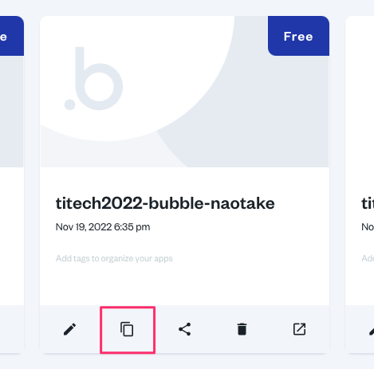

---

- A dialog box for the name of the application after copying is displayed.
- Leave the `Copy the application database content` checkbox OFF, since you will not be using the previous data.
- Click COPY

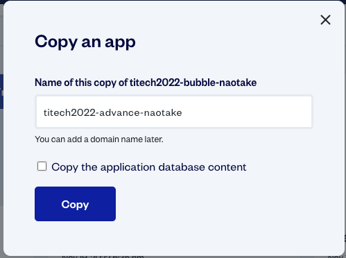

---

- When the copying is finished, it is OK if the edit screen (index) of the copied application is displayed

---

##### Preparation for YouTube integration

- We will do the necessary preparations for displaying a list of YouTube videos.
- In this lecture, we will use various APIs provided by Google's cloud service "Google Cloud Platform".
  - Think of it as Google's version of Amazon's "Amazon Web Service" (AWS).

---

- Access the following URL
  - https://console.developers.google.com/
- Sign in with your Google Account
  - If you do not have a Google Account, please create one.

---

- After logging in, when you access the Google Cloud Platform (GCP) screen for the first time, you will see a dialog like this, select your country, check the Terms of Service, and "Agree and Continue".

---

- Once you agree, you will see the API and Services dashboard, and click the Create Project link to create a project (box) for this lecture.

---

- When the Create New Project screen appears, specify an appropriate name for the project and create it.

---

- When the creation is complete, the dashboard of the created project will be displayed.
- If you see the name of the project you created at the top of the screen to the left of Google Cloud, you are good to go.

---

- Next, we will issue the authentication key needed to display the YouTube video list.
- Type "API" in the search box at the top of the screen to open the API and Services menu

- Select "APIs and Services" in the "Projects and Pages" block from the list of suggestions

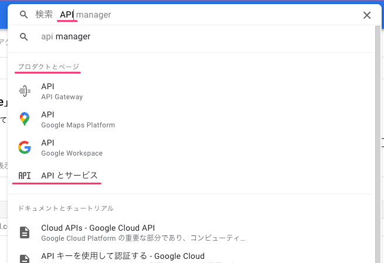

---

- When the API and Services page opens, select "Credentials" from the left menu.
- The right panel will change to "Credentials", click "+ Create Credentials" at the top of the screen.
- Select "API Key" from the pop-up window.

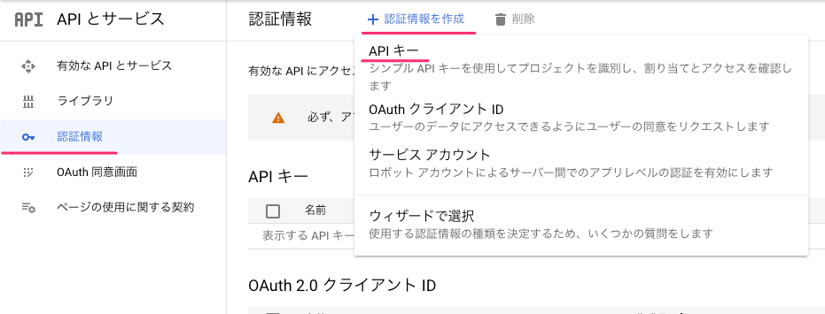

---

- You will then get a pop-up message saying that your API key creation is complete, so take note of the value.
- You will be asked to limit the keys, but we will delete these keys at the end of the lecture, so we will leave it as is.

---

- Now that we have issued the key to retrieve the YouTube listings from Bubble, let's configure the Bubble side.
- First, let's prepare to get the YouTube listings from Bubble via API.

---

##### Preparing Bubble for API integration

- Select Plugins from the left menu and check that the `API Connector` is already present in the Installed Plugins.

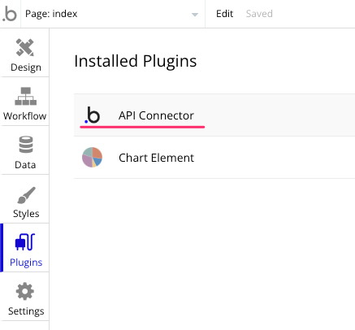

---

- If it is not included, click the Add plugins button.
- Search for "API" and install the plugin `API Connector`.

---

- This plugin is designed to connect Bubble apps to other APIs that are publicly available, and to information on the other side of those APIs.
- Some Bubble plugins are specialized for specific APIs and are simpler to configure than the API Connector.
- Let's use the YouTube API via the API Connector plugin in its most basic form to display a list of videos.

---

- Now let's configure the YouTube API to use it
- In the Plugins tab, select "API Connector" from the Installed Plugins list.
- In the right panel, you will see a summary of this plugin, and below that, click "Add another API" to start setting up your new API connection

---

- "Add another API", you should see API configuration components like this
- Here is a brief description of each item and its settings

---

1. API Name: Group name for this API linkage
  - In this case, it is YouTube.

---

2. Authentication: Common authentication method for APIs under this group.
  - In this case, "None or self-handled".

---

3. Shared headers for all calls: Common header information to be specified for all APIs under this group.
  - Not specified at this time

---

4. Shared parameters for all calls: Common parameter information to be specified for all APIs under this group.
  - Not specified at this time

---

- Next, let's set up the API for this group.
- Click on the "expand" link to the right of the "API Call" block on the previous screen.

---

- Then you will see the specific API configuration items, which are briefly explained below

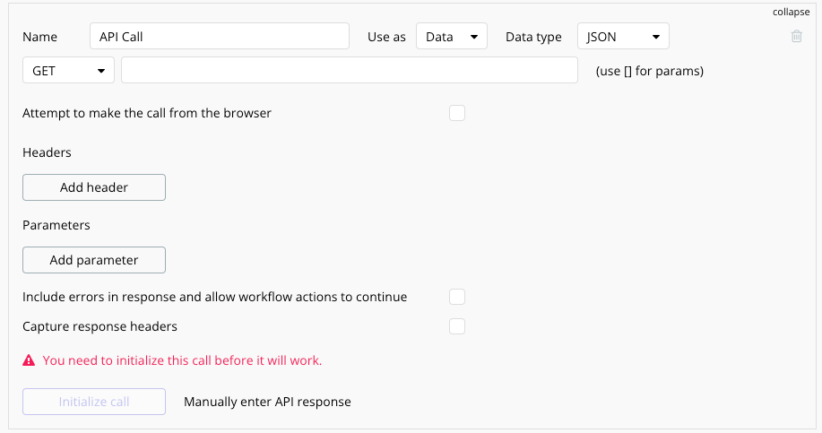

---

1. Name: A specific API name.
  * In this case, enter "search".

---

2. Path: URL of the specific API
  * In this case, enter `https://www.googleapis.com/youtube/v3/search`.

---

3. Headers: Header information specific to this API
  * Not specified at this time

---

4. Parameters: Parameter information specific to this API
  * In this case, the following two parameters are specified: Private / Allow blank / Optional as shown in the attachment. 1.
    1. Key: `key`, Value: the API key you just issued in your Google account 2.
    2. Key: `q`, Value: Keyword for searching behavior on YouTube (feel free to specify)

---

- When everything is set up, it looks like this

---

- When you are done, check to make sure your settings are correct
- Click the "Initialize call" button at the bottom

---

- You probably got back an error message with Status code 403
- The content of the message is as written, but in summary it looks like this

> YouTube Data API v3 is disabled in your project.
> Please visit this URL to enable it and try again.

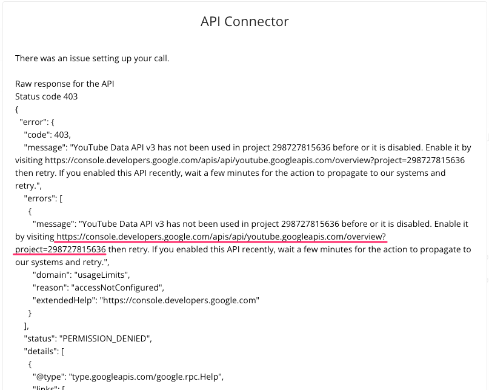

---

- It seems that the YouTube Data API we used this time is not enabled on each person's Google account.
- This is because Google has turned off the function that not everyone will use from the beginning, and only those who need it can turn it on by themselves.
- So, since we want to use the YouTube Data API, let's access the URL in the message to enable it.
  https://console.developers.google.com/apis/api/youtube.googleapis.com/overview?project={各人のプロジェクトID}

---

- You should then be redirected to the "YouTube Data API v3" screen.
- Click "Enable" to activate it as indicated on the screen.

---

- After a few moments, you should be taken to a screen like this
- If the red line at the top of the screen reads "Disable API," the activation was successful.

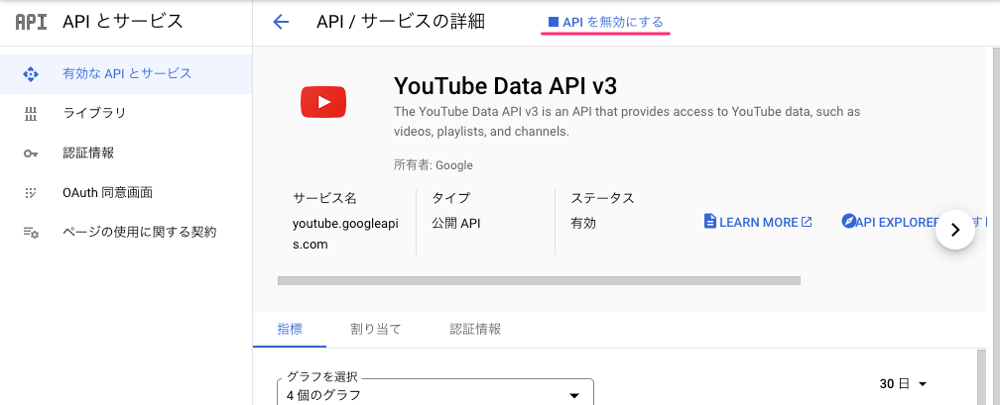

---

- Now that the YouTube Data API has been activated, go back to the Bubble screen and click the "Initialize call" button.
- If successful, you should see a popup saying "Returned values - search

---

- This shows the result (response) of executing the "https://www.googleapis.com/youtube/v3/search" API that you have set up this time

---

I won't go into details, but the three main points are as follows.

- The `items(list)` is the list of videos in the search results.
- The type of the list is `search item`, which means that it is the data of multiple items in the search results.
- And the most important part is the `id videoId`.

---

- As you may know if you have seen YouTube before, this VideoId is the information that uniquely identifies each video, and this Id is also required to display the video on the screen.
- Other items that do not refer to any particular field are confusing, so select `Ignore field` from the pull-down menu.
- By doing so, when you handle it as Dynamic data, it will not be displayed in the choices, and you will not have to worry when you select a setting item.

---

- This is what it looks like when everything is set up
- When you are done, click "SAVE" to save your settings

---

##### Preparation of Screen Display

- Now that Bubble's API integration is ready, it's time to set up the screens!
- We believe that you have already mastered screen setup in the previous and current lectures, so we will just give you an overview and let you try to build your screen layout.

---

- Create the "video_list" screen by cloning the pet_list page.
- Delete all the contents of each cell in the Repeating Group.
- Instead, place Video in the Visual elements to fill the cell.
- It looks like this.

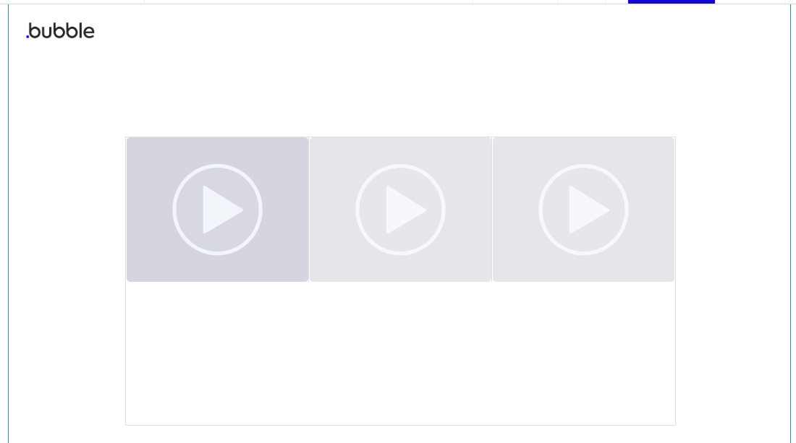

---

- Now that we have a layout, let's actually set up the YouTube listing.
- First, the Type of content in the Repeating Group will be the `search item` type that we just checked when executing the API.
- The type of data to be repeated will now be each YouTube video.

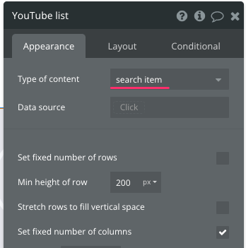

---

- Next is Data source. This time, we will target the list of YouTube videos obtained from the API.
- If you look at the candidates from Click, you will find an item called `Get data from an external API`, so select it.

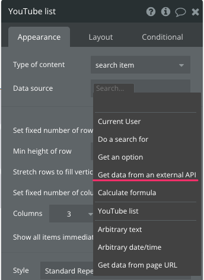

---

- Next to the Get data from an external API popup, select the API provider pull-down.
- Then select the `YouTube - search` that you have just set in the pull-down menu.
  - (The hyphen before is the API group name, and the hyphen after is the name of the specific API.

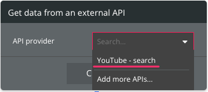

---

- Once the API Provider is set, close it with CLOSE
- Then, in the original Repeating Group, select `'items` as the Data source.
- Now you have specified that the list of videos (items) included in the API results will be repeated.

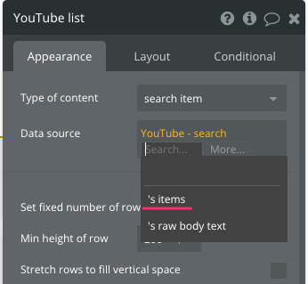

---

- Next, let's set up each cell, but first, let's set up everyone!

- Hint :bulb:
  - Video source is YouTube
  - Then you will see an item called Video ID, which should refer to the `Video Id` you saw when you set up the API earlier.

---

- Something like this.

---

- Now you're all set! Let's preview it now!
- Do you see a list of videos for the keywords you specified in the API in advance?

---

---

##### Let's try Google Login!

- Next, let's try signing in to the Bubble app with your Google account!
- First, install the Google plugin

---

- Select the Google plugin you have installed
- Check the `Use a generic redirect URL` box in the right panel.
  - Note down this URL as well, but since you cannot select it on the screen, please replace the app name part of the URL below with your own app name and write it down. 😅
  - `https://{Your App Name}.bubbleapps.io/api/1.1/oauth_redirect`

---

---

##### Prepare to authenticate back to your app after logging in to Google

- Access the Google Cloud Platform screen

https://console.developers.google.com/

- Display the same API and Services screen as before

---

- Select the project and choose "OAuth Consent Screen" from the left menu

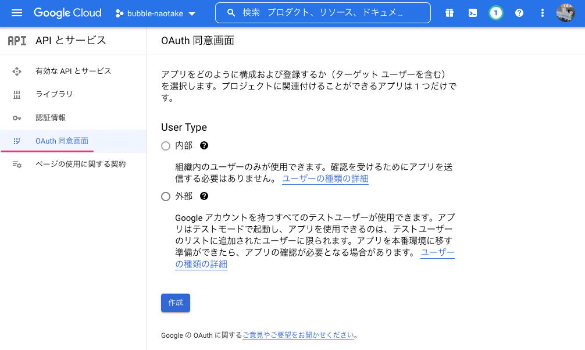

---

- Select "External" for User Type and click Create

- Fill in the required information on the next page

---

- App Information
  - App name: The name of your app as created in bubble
  - User Support Email: Your Google Account email address

---

- Approved Domains
  - bubbleapps.io
- Developer Contact Information
  - Your Google Account email address
- "Save and Continue"

---

- Scope is "Save and Next" without changing any settings.

---

- Enter your Google email address as the test user.
- After setting up, save and continue.

---

- Now that registration is complete, we will issue the credentials.
- Select "Credentials" from the left menu and click "+ Create Credentials".
- Select OAuth Client ID from the submenu

---

- The Create OAuth Client ID screen will appear, enter the following information and "Save".

- Application Type: Web Application
- Name: `Bubble OAuth

---

- Authorized redirect URI: The URL that the Bubble side has noted when installing the Google plugin.
  `https://{Your App Name}.bubbleapps.io/api/1.1/oauth_redirect`

---

- Click "Create."
- Then you will see a popup saying "OAuth client created", where the client ID and client secret are displayed, so write them down.
  - If you forget to write them down, you can download the JSON file.
- After writing down the information, click OK to close.

---

##### Set the issued credentials on Bubble

- Return to the Google Plugin screen of Bubble, and enter the keys you have just obtained into the respective fields.
  - Client ID → AppID/API Key
  - Client Secret → App Secret

---

- This completes the preconfiguration.
- Next, we will build the login function.

---

##### Replace the login mechanism with Google

- Open the header of the Reusable elements created in the previous lecture

---

- Open the Workflow tab and open the workflow for the login button
- Now only the action to go to the login page (index page) is set, so we will review this.

---

- Since we will be using the login screen provided by Google, we will delete the action to move to the login screen (index page) on the Bubble side.

---

- Next we will set up a workflow for Google Login.
- Click here to add an action... Click here to add an action...
- Select Signup/login with a soccial network from Account

---

- Signup/login with Google popup will appear
- Select Google as OAuth provider
- Since you have configured Google and Bubble plugins in advance, you can now use Google Authentication! 🙌

---

- 折角なのでログイン成功したらヘッダー上部にアカウント名と画像を表示してみましょう

---

- Switch to the Design tab and display the following three components from the Elements tree, which are currently hidden
  - (If you don't do this, it will be difficult to see the image after the image is added.

---

- Select Image from Visual elements and place the image between the "Pet Register" link and the "Log in" button.
  - Make sure it is a 50 x 50 square

---

- Then, set up the image references.
- If you are a Bubbler, you know what to do!
- Dynamic image for dynamic display
- The image you want to display is the profile image of the currently logged in user's Google Account.

---

- Something like this.

---

- Now let's preview!
  - If you have the same email address in User of Data as the Google email address you are going to use to check the operation, please delete it.
- When you click the "Login" button, you will be redirected to the Google login screen, and when you login there, you will be redirected back to the Bubble side, right?
- By the way, when you log in, the email address information of the Google account you logged in is registered in the User data on the Bubble side.
  - Of course, your password is not saved, so don't worry! :smile:

---

---

##### Finally, let's incorporate a search function using the YouTube API

---

- Currently, the YouTube API authentication key and search keywords are fixed.
- So let's change them as follows
  - Authentication keys are obtained from the logged-in user information (add a new field)
  - Search keywords can be entered and searched from the screen.

---

I'll give you a hint on the next page so you can try it first!

---

- First, add a field called `key` for the User and set it in advance.
  - (Normally, it would be more natural to have the user enter the key himself, but for the sake of time, we will skip the API key setting screen this time.
- If you want to dynamically set API parameters in the process, first remove the fixed values and uncheck `Private` so that you can specify the parameters when calling the API from a DataSource, etc.
- Place a new search element (text box and search button) on the video_list page, and when the search button is clicked, search via YouTube API and set the result to the Repeating Group.

---

# :hourglass_flowing_sand:
# :hourglass_flowing_sand:
# :hourglass_flowing_sand:
# :hourglass:
# :hourglass:

---

- Here are the important points
- First, add a field called `key` for the User type

---

- Then, set the authentication key (API key) obtained this time to the registered User in advance

---

- Next, the YouTube API settings look like this

---

- The key point is that we have removed the Value values for items that we want to specify dynamically, and unchecked the Private checkbox.
- This allows the values of these parameters to be specified when using the API.

---

- In addition, let's add two search options
- key: `maxResults`, the number of data to retrieve in one search.
  - Default is 5.
- key: `type`, type of data to search.
  - By specifying `video`, you can search only videos.

---

- Next, empty the Repeating Group's Data source.
- The target data to be displayed is set in the workflow of the new search function, so there is no problem even if this field is empty.

---

- Next, set up a workflow for the newly prepared search button for the keyword search.
- In this case, the action is for an element (Repeating Group), so select "Display list" in the "Element Actions" section.

---

- For Data source, select Get data from an external API to display data via API.
- Then select `YouTube - search` for the API provicer, and you should see two params that were not there before.
- This is because you have just unchecked the Private checkbox for the parameters you want to specify dynamically in the YouTube API settings.
- The value to be specified here is the usual Dynamic data.

---

- Here's what it looks like when set up

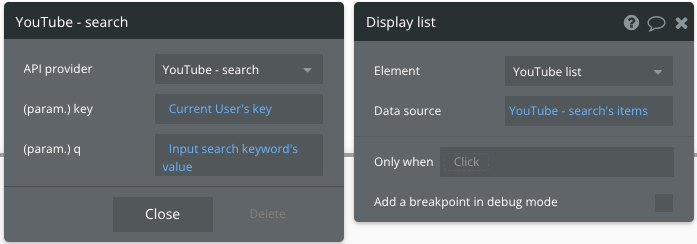

---

#### Let's preview it!

- Did you see the list of videos you entered in the keyword field while logged in?

---

- How did you like it?
- I think that by working with APIs, the range of things we can do with Bubble has expanded even more!
- There may be teams that use external APIs at the camp, and if so, let's put what we learned today to use and practice API integration!

---

## Tips for Collaborating with Bubble

Here are some tips to help you and your team collaborate with Bubble

---

#### How to invite team members in Bubble

To co-edit one app with your team members...
- You will need to prepare one account for your team, and then everyone will log in to that account and use it together.

---

- Bubble has the ability to co-edit in the regular way, but... 💰💰💰

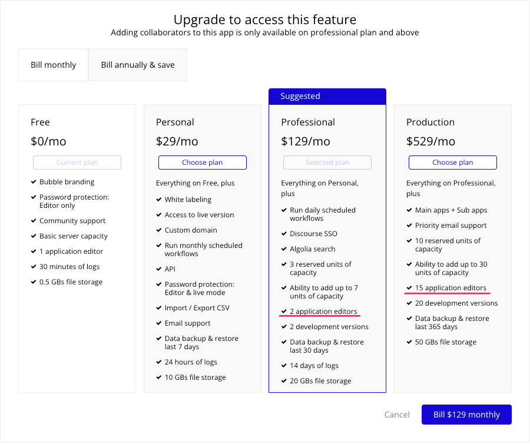

---

#### Notes on simultaneous edits in Bubble

- Avoid simultaneous editing on the same element (it will be overwritten by edits made later).
  - For this reason, it is recommended to assign a person in charge of each screen and avoid simultaneous editing of the same screen.
- Other than that, there are no special notes.
- Edits are reflected in real time on other people's screens.
  - Not only screen edits, but also database and Workflow edits are reflected in real time.
- If you divide the work by screen, you can develop without difficulty.

<!-- ---
モブプログラミングの紹介?
- ドライバーとナビゲーターみたいなお話を盛り込む？ -->

---

## Team Development Exercise

- Try developing one new app with your DevelopmentPhase team!
  - Make it different from the one you are planning to develop in DevelopmentPhase!
- You can choose to use either Adalo or Bubble!
  - You can choose the one you plan to use in DevelopmentPhase, or you can choose both!
- Make sure everyone has a hand in it!

---

#### Example of how to divide up the work

- First, everyone should work together to identify screens and functions and design the database.
- Assign a person to be in charge of each screen (e.g., in charge of the registration screen, the list screen, the detail screen, the update screen, etc.)
- There is also a method in which multiple people work on a single PC. In this case, the person in charge of operating the PC and the person giving instructions should switch periodically.

---

# :hourglass_flowing_sand:
# :hourglass_flowing_sand:
# :hourglass_flowing_sand:
# :hourglass:
# :hourglass:

---

#### Presentation of Exercise Results

Let's have each team present about the apps they made in the exercise!

---

## Summary

- That's all for this Learning Phase lecture!
  - Have you mastered Adalo and Bubble?
  - Did you get an idea of how team development works?
- From next time, we will start the Development Phase, where we will brush up and develop the ideas presented by each team.
  - In preparation for this phase, let's reconfirm our ideas and select tools (Adalo, Bubble, or others?) to be used in the development phase. (Adalo? Bubble? Other?)) to be used in the development.

Translated with www.DeepL.com/Translator (free version)

---

### Finally.

- Remove API keys and OAuth information issued by Google Cloud Platform!

---

# That's all!
# Thank you for your hard work!
